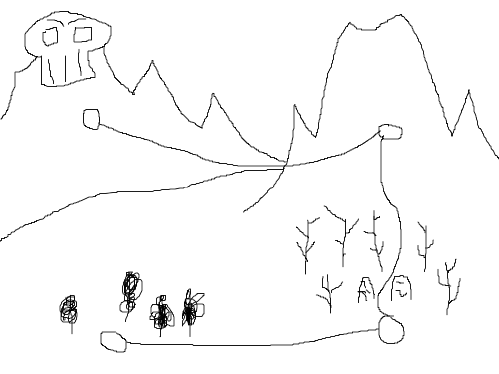

# Binding of Zelda

Startdocument of **Victor Peters, Nick Buisman** and **Robin van Dijk**.

## Game Description

The game we are making is called the Binding of Zelda. The game will be a dungeon crawler/roguelike inspired by the original Legend of Zelda games and modern games like the Binding of Isaac and Enter the Gungeon. The game will have four areas. The levels within the areas are procedurally generated. Each area will have different enemies based on the overall theme of the area (a forest area will have animal-inspired enemies and a graveyard area will have skeleton-based enemies).

The engines we are considering for the development of this game are **monogame** and **godot**.
Monogame: https://www.monogame.net/.
Godot: https://godotengine.org/.

## Planning

Week 1: Making a startdocument.

Week 2 + 3: Class diagram and learning how to use the library and engine.

Week 4 - 7: Programming and testing the game.

Week 8: Testing the full game and preparing a presentation.

Week 9: Presenting our game to the teachers.

## Screens
Below is a list of screens that will be in the game.

## Start menu

## Level select

## Options menu

## The first level

## The second level

## The third level

## The fourth level

